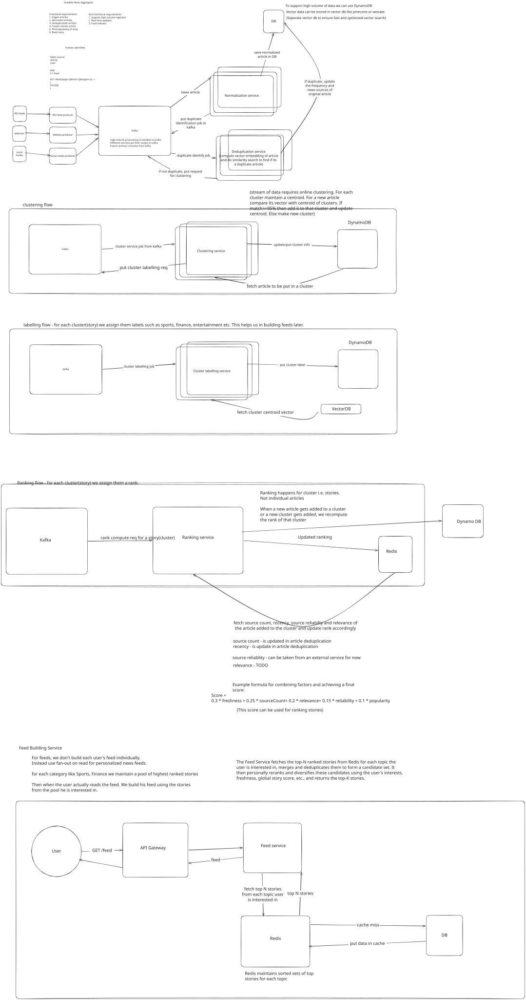

# Scalable News Aggregator

A high-level system design for a **scalable, real-time news aggregation platform** that ingests articles from multiple sources, normalizes and deduplicates them, clusters related coverage into stories, ranks those stories, and builds personalized user feeds.



## Requirements

### Functional requirements

1. Ingest articles from multiple news sources.
2. Normalize incoming articles into a common format.
3. Deduplicate articles reporting the same content.
4. Cluster similar articles into a single story.
5. Determine story popularity.
6. Rank stories.
7. Build personalized feeds for users.

### Non-functional requirements

- Support **high-volume ingestion**.
- Provide **real-time updates**.
- Be **fault tolerant**.

## Core Entities

- **News Source**
- **Article**
- **User**
- **Story / Cluster** — a group of related articles covering the same event or topic.

## Feed API

```http
GET /feed?page={page}&limit={limit}&region={region}
```

Response:

```text
Article[]
```

## High-Level Architecture

The system is built as an event-driven pipeline around **Kafka**. Each processing stage consumes jobs from Kafka, performs one responsibility, persists any required state, and publishes work for the next stage.

```text
RSS Feeds ───────> RSS Feed Producer ───┐
Websites ────────> Website Producer ─────┼──> Kafka
Social Media ────> Social Media Producer ┘
                                           │
                                           v
                              Normalization Service
                                           │
                                           v
                                  Deduplication Service
                                           │
                                           v
                                    Clustering Service
                                           │
                            ┌──────────────┴──────────────┐
                            v                             v
                  Cluster Labelling Service        Ranking Service
                                                          │
                                                          v
                                                        Redis
                                                          │
                                                          v
User ──> API Gateway ──> Feed Service ────────────────────┘
```

## 1. News Ingestion

News enters the platform through independent producers for sources such as:

- RSS feeds
- News websites
- Social media

These producers publish incoming news articles to **Kafka**.

Kafka is used to handle high-volume processing and decouple services. A service can consume the output produced by an earlier stage and publish its own output for downstream services.

## 2. Normalization

The **Normalization Service** consumes raw news articles from Kafka and converts them into a consistent internal article representation.

After normalization:

1. The normalized article is persisted in the database.
2. A duplicate-identification job is published to Kafka.

## 3. Deduplication

The **Deduplication Service** determines whether a normalized article is already represented by an existing article.

The proposed flow is:

1. Compute a vector embedding for the article.
2. Run a similarity search against existing article vectors.
3. If the article is a duplicate:
   - Update the original article's **frequency/source count**.
   - Update the set of **news sources** covering it.
   - Update recency where appropriate.
4. If it is not a duplicate:
   - Publish a clustering request to Kafka.

A dedicated **Vector DB** such as Pinecone or Weaviate can store embeddings so vector similarity search remains independent and optimized.

The design proposes **DynamoDB** for high-volume article data storage.

## 4. Online Story Clustering

Incoming unique articles must be grouped into stories while data is continuously arriving, so the architecture uses an **online clustering** approach.

Each story cluster maintains a **centroid vector**.

For every new article:

1. Fetch the article embedding.
2. Compare it against existing cluster centroid vectors.
3. If similarity is approximately **95% or greater**, add the article to that cluster.
4. Update the cluster centroid.
5. Otherwise, create a new cluster.

The clustering service stores or updates cluster information in DynamoDB and publishes downstream jobs through Kafka.

> The 95% similarity threshold is the threshold shown in the design and would need tuning using production data.

## 5. Cluster Labelling

The **Cluster Labelling Service** assigns categories to story clusters, for example:

- Sports
- Finance
- Entertainment

These labels are later used to efficiently build personalized feeds.

## 6. Story Ranking

Ranking happens at the **story/cluster level**, not at the individual article level.

A cluster's rank is recomputed when:

- A new article is added to the cluster, or
- A new cluster is created.

The ranking service uses signals including:

- **Freshness / recency**
- **Source count**
- **Relevance**
- **Source reliability**
- **Popularity**

The example score in the design is:

```text
Score =
    0.30 * freshness
  + 0.25 * sourceCount
  + 0.20 * relevance
  + 0.15 * reliability
  + 0.10 * popularity
```

The diagram notes that:

- Source count is updated during article deduplication.
- Recency is updated during article deduplication.
- Source reliability can initially come from an external service.
- The exact relevance signal is still **TODO** in the design.

Updated rankings are written to **Redis**.

## 7. Ranked Topic Pools in Redis

Redis maintains **sorted sets of top-ranked stories for each topic**.

Conceptually:

```text
sports        -> ranked story IDs
finance       -> ranked story IDs
entertainment -> ranked story IDs
...
```

This avoids scanning and ranking the complete story database every time a user requests a feed.

The persistent database remains the source of truth, while Redis acts as the fast serving layer for ranked story pools.

## 8. Personalized Feed Generation

The system does **not** precompute and store a separate feed for every user.

Instead, it uses **fan-out on read**.

When a user requests:

```http
GET /feed
```

The request flows through:

```text
User -> API Gateway -> Feed Service
```

The Feed Service then:

1. Determines the topics the user is interested in.
2. Fetches the **top-N stories** from Redis for each relevant topic.
3. Merges the results into a candidate set.
4. Deduplicates overlapping candidates.
5. Personally reranks and diversifies the candidates using signals such as:
   - User interests
   - Freshness
   - Global story score
6. Returns the final **top-K stories**.

In compact form:

```text
User interests
      │
      v
Top-N stories/topic from Redis
      │
      v
Merge + deduplicate
      │
      v
Personal reranking + diversification
      │
      v
Top-K feed
```

## 9. Caching

Redis is used as the main low-latency cache/serving layer for ranked topic pools.

The feed path also shows a database fallback:

```text
Feed Service -> Redis
                  │
             cache miss
                  │
                  v
                 DB
                  │
             populate cache
                  │
                  v
                Redis
```

This keeps common feed reads away from the primary database while preserving a fallback when data is absent from cache.

## Storage Responsibilities

| Storage | Responsibility |
|---|---|
| **DynamoDB** | Persistent article and cluster data; selected for high-volume access patterns in the design. |
| **Vector DB** | Article embeddings and cluster centroid vectors used for similarity search. |
| **Redis** | Ranked per-topic story pools and cached data required by the feed-serving path. |
| **Kafka** | Event/job transport between ingestion and processing services. |

## End-to-End Data Flow

```text
1. Source produces article
        │
        v
2. Kafka
        │
        v
3. Normalize article
        │
        v
4. Persist normalized article
        │
        v
5. Deduplicate using vector similarity
        │
        ├── Duplicate -> update source count / sources / recency
        │
        └── Unique
              │
              v
6. Online clustering
        │
        ├── Match existing centroid -> update cluster
        └── No match -> create cluster
              │
              v
7. Label cluster
        │
        v
8. Compute/update story rank
        │
        v
9. Update topic sorted sets in Redis
        │
        v
10. User requests feed
        │
        v
11. Fetch top-N stories from interested topics
        │
        v
12. Merge + deduplicate + rerank + diversify
        │
        v
13. Return top-K personalized stories
```

## Key Design Decisions

### Event-driven processing

Kafka isolates stages of the processing pipeline. Producers and consumers do not need to execute synchronously, making it easier for individual stages to scale independently.

### Story-level ranking

The system ranks **clusters/stories rather than individual articles**. Multiple publishers covering the same event therefore contribute signals to one story instead of flooding the feed with near-identical articles.

### Online clustering

Because articles arrive continuously, clustering happens incrementally instead of periodically recomputing all clusters from scratch.

### Vector search separated from operational storage

Embeddings and centroid similarity searches are handled by a vector database, while article and cluster metadata remain in DynamoDB.

### Fan-out on read

The design maintains ranked topic pools rather than materializing a feed for every user. Personalized feeds are assembled only when requested.

## Components

```text
Ingestion
├── RSS Feed Producer
├── Website Producer
└── Social Media Producer

Processing
├── Normalization Service
├── Deduplication Service
├── Clustering Service
├── Cluster Labelling Service
└── Ranking Service

Serving
├── API Gateway
└── Feed Service

Infrastructure
├── Kafka
├── DynamoDB
├── Vector DB
└── Redis
```

## Open Items From the Design

The diagram explicitly leaves the exact **relevance** calculation as a TODO. The ranking weights and online-clustering similarity threshold are also example design parameters rather than validated production values.

---

This repository contains the high-level architecture for a scalable news aggregator focused on **stream processing, story deduplication/clustering, story-level ranking, and low-latency personalized feed generation**.
